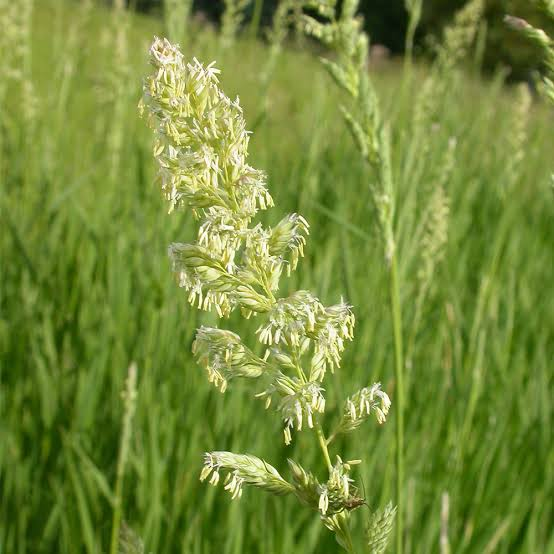
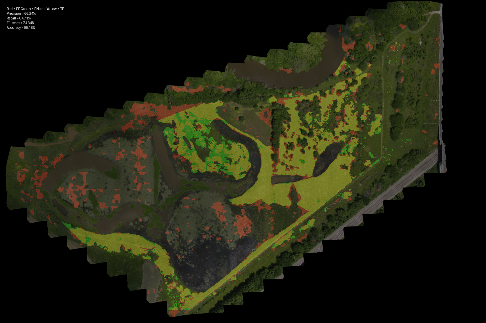

# RCG Segmentation Software

Reed Canary grass is an invasive species that poses a significant threat to the environmental equilibrium of Missouri Wetlands. This project offers pretrained semantic segmentation models capable of effectively and accurately identifying Reed Canary grass areas within high-resolution imagery. 


<p align="center"></p>

## Installation

### Clone the repository
You can either use the cmd window to clone the repo using the following command
```
git clone https://github.com/YangZhangMizzou/RCG_Segmentation.git
```

### Create virtual environment
Virtual env is recommended to be used in order to install the package, here Anaconda is recommended to be used, link to the Anaconda https://www.anaconda.com/, once you have installed the Anaconda , refer here to create you virtual env https://conda.io/projects/conda/en/latest/user-guide/getting-started.html. It is recommend to create the env along with python 3.9, demo cmd is here:

```
conda create -n RCG python==3.9
conda activate RCG
cd RCG_Segmentation_main
```

### Install pytorch

We recommend to install pytorch with cuda to accelerate running speed.
```
conda install pytorch==1.10.0 torchvision==0.11.0 torchaudio==0.10.0 cudatoolkit=11.3 -c pytorch -c conda-forge
```
### Install dependencies

Install Detectron2 following the instructions on the website. https://detectron2.readthedocs.io/en/latest/index.html
and then run the following command

```
pip install numpy
pip install math
pip install pickle
pip install tqdm
pip install logging
pip install Pillow
pip install shutil
```


## File arrangement
The whole projects are regnized as shown. Please unzip you download in correct directories
```
├──checkpoint
│   ├── 60_models
        ├── deeplabv3_resnet50_rcg
        ├── deeplabv3_resnet101_rcg
        ├── ...
        └── psp_resnet101_rcg
│   ├── 90_models
        ├── deeplabv3_resnet50_rcg
        ├── deeplabv3_resnet101_rcg
        ├── ...
        └── psp_resnet101_rcg

──images
  ├── Caroll_Jul_14_22
  ├── Caroll_Jun_14_22
  ├── ...
  └── psp_resnet101_rcg
```
We also provided our training and test dataset. You can download them using this link.


### Inference:
Once you have the input file ready and in correct virtual env, you can use the file **scripts/infer_big_image.py** to start inference the images:
quick example(full command):
```
python scripts/infer_big_image.py \
--path retinanet ./images \
--altitude 90 \
--checkpoint_dir ./checkpoint \
--save_dir ./result \
--model fcn16s \
--backbone vgg16 \
--image_size 512 \
--evaluate True \
```

quick example(easy command):
```
python scripts/infer_big_image.py \
--path retinanet ./images \
--checkpoint_dir ./checkpoint \
--save_dir ./result \
```

#### Support models

We support multiple models. You can try following backbone and model combinations

```
fcn8s+vgg16
fcn16s+vgg16
fcn32s+vgg16
psp_resnet50
psp_resnet101
deeplabv3+resnet50
deeplabv3+resnet101
```

## Result
Our software generate the following outputs if you choose to evaluate.
```
image_resize.png -> 10 times resacled original image for esay view
prediction.png -> mask label(1 for RCG and 0 for background)
prediction_resize.png -> 10 times resacled mask for esay view
painting.png -> colored mask which indicates tp,fp and fn.
```

Here is an example of painting.png image.
<p align="center"></p>

## References
- [PyTorch-Encoding](https://github.com/zhanghang1989/PyTorch-Encoding)
- [maskrcnn-benchmark](https://github.com/facebookresearch/maskrcnn-benchmark)
- [gloun-cv](https://github.com/dmlc/gluon-cv)
- [imagenet](https://github.com/pytorch/examples/tree/master/imagenet)


<!--
[![python-image]][python-url]
[![pytorch-image]][pytorch-url]
[![lic-image]][lic-url]
-->

[python-image]: https://img.shields.io/badge/Python-2.x|3.x-ff69b4.svg
[python-url]: https://www.python.org/
[pytorch-image]: https://img.shields.io/badge/PyTorch-1.1-2BAF2B.svg
[pytorch-url]: https://pytorch.org/
[lic-image]: https://img.shields.io/badge/Apache-2.0-blue.svg
[lic-url]: https://github.com/Tramac/Awesome-semantic-segmentation-pytorch/blob/master/LICENSE
